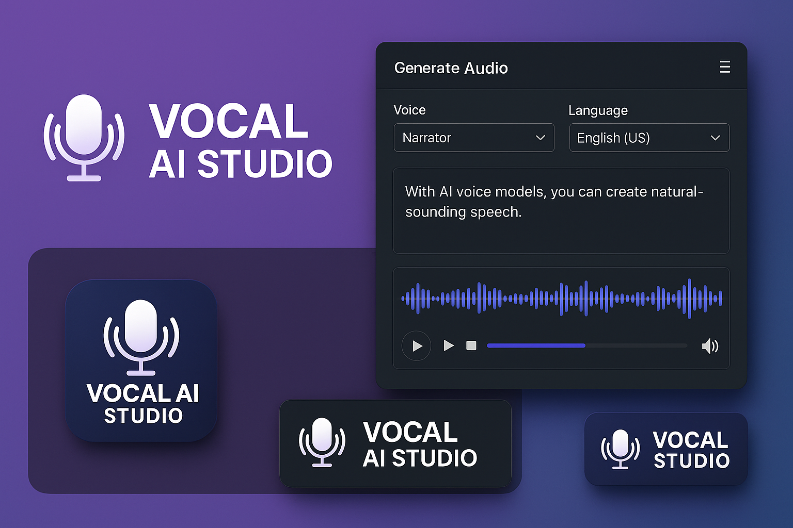

# Vocal-AI-Studio-V1
This is a modern full-stack application for the Vocal AI Studio with React frontend, Flask backend, and integrated AI model serving. This will include artist selection, vocal generation, and audio playback.


# Vocal Mood Studio



A full-stack AI-powered vocal generation platform specializing in Deep House, Vocal House, and Nu Disco genres with emotional mood controls.

## Table of Contents
- [Features](#features)
- [Tech Stack](#tech-stack)
- [Installation](#installation)
- [Development](#development)
- [Deployment](#deployment)
- [Project Structure](#project-structure)
- [API Reference](#api-reference)
- [Contributing](#contributing)

## Features

🎤 **Vocal Generation**
- Deep House moody atmospheres
- Vocal House intimate textures  
- Nu Disco retro vibes

🎛️ **Mood Controls**
- Intimacy, Warmth, Intensity sliders
- Real-time audio visualization
- Dynamic atmosphere generator

🔧 **Audio Tools**
- Professional vocal effects chain
- BPM/key detection
- Multi-format export (WAV, MP3)

## Tech Stack

**Frontend**
- React 18 + Vite
- React Bootstrap 5
- Canvas API
- Web Audio API

**Backend**  
- Flask (Python)
- PyTorch (AI models)
- Librosa (audio processing)

**Infrastructure**
- Docker + Compose
- NGINX (production)
- GitHub Actions CI/CD

## Installation

### Prerequisites
- Docker 20.10+
- Node.js 18+
- Python 3.9+

```bash
# Clone repository
git clone https://github.com/yourusername/vocal-mood-studio.git
cd vocal-mood-studio

# Start with Docker
docker-compose up --build

# Development

```bash
cd frontend
npm install
npm run dev


```bash
cd backend
python -m venv venv
source venv/bin/activate
pip install -r requirements.txt
flask run

# Producti
```bash
docker-compose -f docker-compose.prod.yml up -d --build